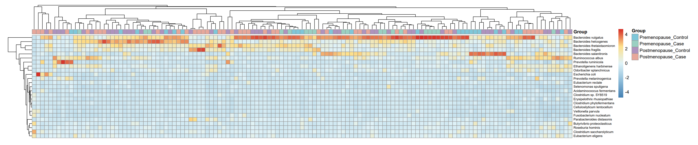

# Rvisuals: A Comprehensive R-based Data Visualization Repository

**Rvisuals** is a personal collection of R scripts that I have developed for generating publication-ready visualizations. Designed for data scientists, researchers, and analysts, these scripts offer reproducible and insightful visual representations of data for analysis and reporting..

---

## Key Features

- **Organized Structure**: Each visualization type is stored in dedicated folders containing clear Input, Script, and Plot subfolders.
- **Easy-to-use**: Plug-and-play R scripts tailored to diverse visualization requirements.
- **Publication-Quality**: Generate high-resolution graphics ready for reports, presentations, and research publications.

---

## 🛠 Installation & Dependencies

Ensure you have R installed and then run:

```R
install.packages(c("ggplot2", "dplyr", "tidyverse", "ggpubr", "patchwork"))
```

---

## Getting Started

Follow these simple steps to create visualizations:

1. Navigate to your desired visualization folder (e.g., `3. Heatmaps`).
2. Place your dataset into the `Input/` folder.
3. Execute the R script found in the `Script/` folder:


## Visualization Examples

-  **Raincloud Plot**: Effectively visualize distributions with combined density, boxplots, and scatter plots.
  
-  **Violin Plot**: Clearly display data distributions and statistical summaries.
  
-  **Heatmap**: Intuitive visualization of matrix data for rapid insights.
  
-  **Correlation Heatmap**: Identify and showcase correlations clearly and succinctly.
  
-  **Association Boxplots**: Highlight relationships between categorical variables and continuous outcomes.
  
---

## Contributing

Contributions are welcome! If you'd like to improve or add visualizations:

- Fork this repository.
- Create a new branch (`git checkout -b new-visualization`).
- Commit your enhancements (`git commit -m 'Add new visualization type'`).
- Submit a pull request.

For significant changes, please open an issue first to discuss your proposal.

---

## Acknowledgments

Special thanks to the vibrant R community and the developers of essential packages:

- [`ggplot2`](https://ggplot2.tidyverse.org/)
- [`dplyr`](https://dplyr.tidyverse.org/)
- [`tidyverse`](https://www.tidyverse.org/)
- [`ggpubr`](https://rpkgs.datanovia.com/ggpubr/)
- [`patchwork`](https://patchwork.data-imaginist.com/)

These tools form the backbone of this visualization repository.

---

## License

This project is open-source. You're encouraged to freely use, adapt, and modify the scripts provided. Please acknowledge this repository if you use or modify its scripts for research or publication.

---

## Support Rvisuals

If you find Rvisuals useful, please give it a ⭐ on GitHub—it motivates continued development!

---

